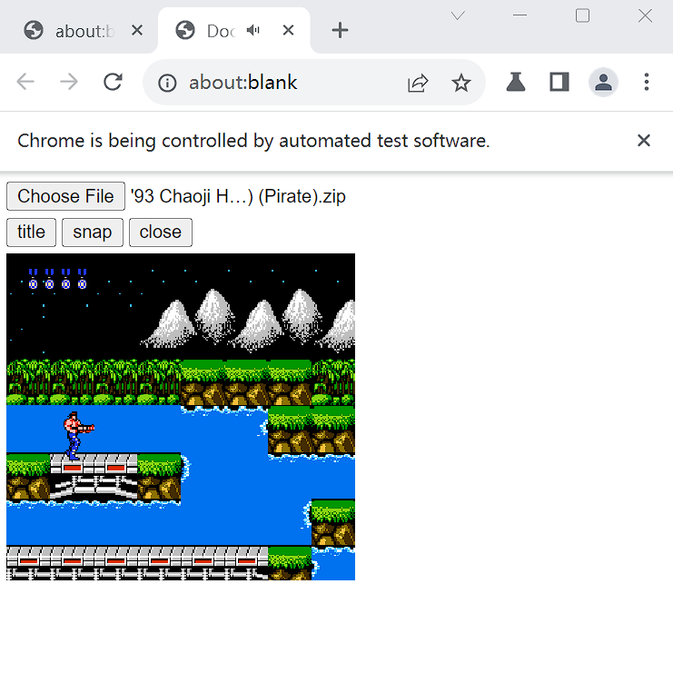

# libretro-thumbnails-tinker

A small program used for creating the missing thumbnails for [libretro-thumbnails](https://github.com/libretro-thumbnails/libretro-thumbnails).

## Screenshot


## Usage
1. Create a directory named `libretro`, download [database-rdb.zip](https://buildbot.libretro.com/assets/frontend/database-rdb.zip) and extract it here.

   For reference, you can use the following commands.
   ```sh
   mkdir libretro
   wget https://buildbot.libretro.com/assets/frontend/database-rdb.zip
   unzip database-rdb.zip -d libretro/database-rdb
   rm database-rdb.zip
   ```
2. Create a `.env` file by copying `.env.sample`, modify it as necessary.
3. Install Node.js dependencies. We use [pnpm](https://pnpm.io/).
   ```sh
   pnpm i
   pnpm playwright install chromium
   ```
4. Run this program by running `pnpm start`.
5. Click the "snap" button, a screenshot will be taken and saved to `libretro/thumbnails/<system>/Named_Titles`, while click the "title" button, a screenshot will be taken and saved to `libretro/thumbnails/<system>/Named_Snaps`. 

   The `<system>` here means the full system name specified in your `.env` file, for example "Nintendo - Nintendo Entertainment System".

   Click the "close" button, a new page will be created to process the next game.

## License
[MIT](license)
